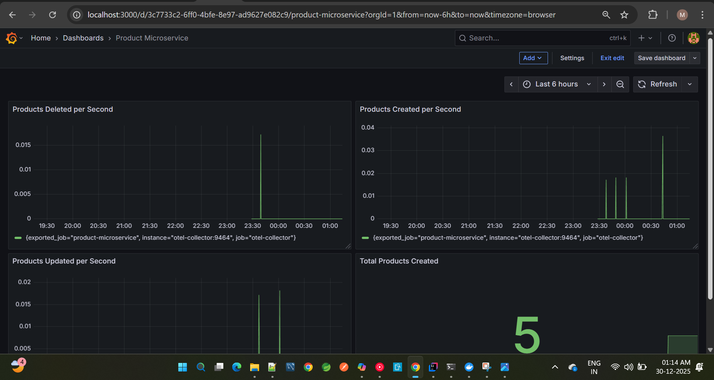
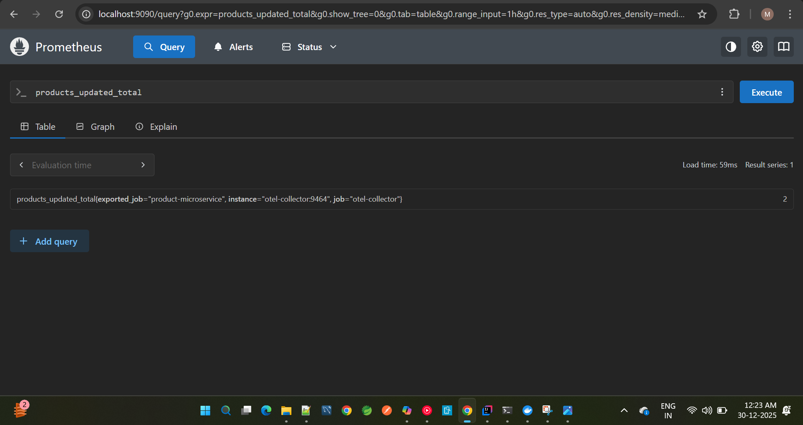
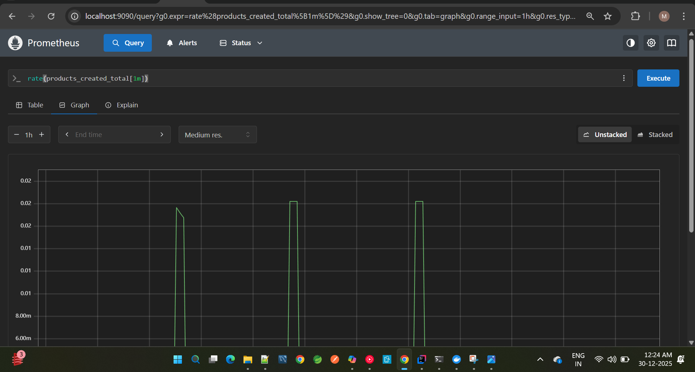
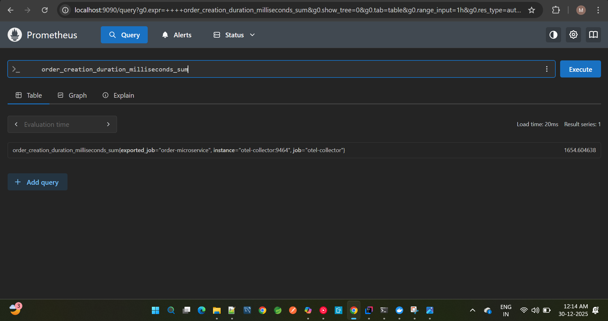
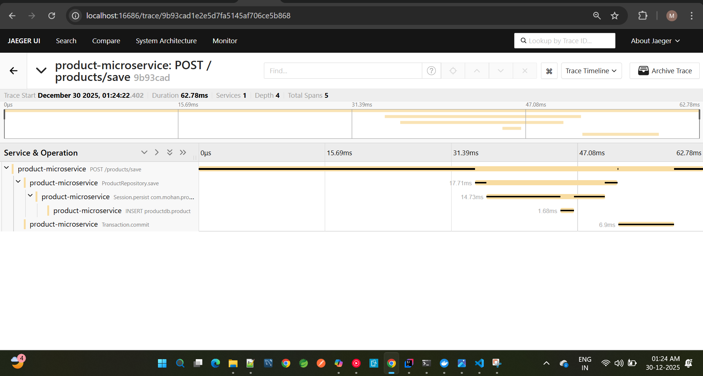
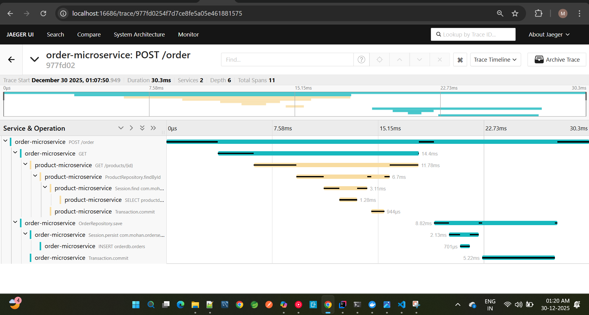

# microservices-observability
This repo is for architectural overview of Microservices-Observability project

# 🛒 Ecommerce Microservices Stack with Observability

This project is a containerized microservices architecture for an ecommerce platform, built with Spring Boot and enhanced with full observability using OpenTelemetry, Prometheus, Grafana, and Jaeger.

# Architecture & Design Showcase

This particular repository showcases the **architecture, design decisions, and observability strategy**
of a microservices-based system built with production-grade patterns.

> **Note:** Source code is intentionally not published.
> This repository focuses on **system design, observability, and operational insights**.

---

## 🎯 Project Goal

The goal of this project is to demonstrate:

- Microservices architecture design
- Service-to-service communication
- Distributed tracing
- Metrics collection and alerting
- Production-ready observability patterns

---

## 🧱 High-Level Architecture

### Components

- API Gateway
- Multiple stateless microservices
- Relational database
- Observability stack (metrics, logs, traces)

## 📦 Services Overview

| Service                | Description                           |
| ---------------------- | ------------------------------------- |
| `product-microservice` | Manages product catalog               |
| `order-microservice`   | Handles order processing              |
| `api-gateway`          | Routes requests to microservices      |
| `mysql`                | Stores product and order data         |
| `otel-collector`       | Collects metrics and traces           |
| `prometheus`           | Scrapes metrics from OTEL Collector   |
| `grafana`              | Visualizes metrics from Prometheus    |
| `jaeger`               | Visualizes traces from OTEL Collector |

---

## 🔁 Request Flow

1. Client request enters via API Gateway
2. Gateway routes to downstream services
3. Services communicate via REST
4. Metrics, logs, and traces are emitted for every request
5. Observability tools aggregate and visualize signals

---

## 📊 Observability Stack

Metrics and traces are exported via OTLP to the OTEL Collector which acts as central system for Observability Stack.

This system implements **below pillars of observability**.

### Metrics

- Prometheus scrapes metrics from OTEL Collector
- Custom application metrics (latency, error rate, throughput)
- Grafana dashboards for visualization

---

### Traces

- Jaeger visualizes distributed traces
- End-to-end request visibility across services
- Latency bottleneck analysis

---

🧪 Health & Debugging

- Jaeger visualizes distributed traces
- End-to-end request visibility across services
- Latency bottleneck analysis

---

## 📸 Screenshots (Proof of Execution)

### Grafana Dashboards
Visualizing throughput, latency, and business metrics across microservices.

---

### Prometheus Metrics
Verifying metric ingestion and scrape health.

---

### Jaeger Distributed Traces
End-to-end request tracing across gateway and downstream services.

---

## ⚙️ Configuration (Sanitized)

Sample configuration files are provided for reference only.

➡️ See: `/configs`

---

## 🔐 Source Code Policy

Source code is intentionally excluded to:

- Focus discussion on **architecture & design**
- Avoid misuse or blind copy-paste
- Encourage interview-based walkthroughs

📌 **Code can be explained or shared selectively during interviews.**

---

## 🧪 Failure Scenarios Covered

- Slow downstream service
- Increased latency detection via traces
- Alerting on error-rate spikes

---

## 📌 Author

**Mohan Chaganti**  
Lead Java Developer
[LinkedIn](https://www.linkedin.com/in/mohan-chaganti-732439177/)